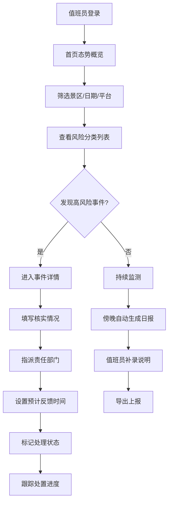
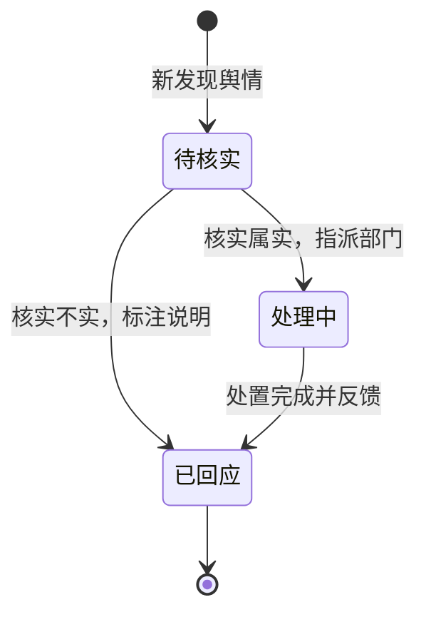

## 1. 产品概述

景区舆情哨兵看板是面向景区管委会值班室的应急值守系统，专注于节假日高峰期间的舆情风险预警与快速处置。系统以"一屏知风险"为核心设计理念，摒弃大而全的报表堆砌，让值班人员打开即可一目了然地掌握今日风险态势。

- **核心价值**：实现舆情风险早发现、早处置、早闭环，提升景区应急响应效率
- **目标用户**：景区管委会值班人员、应急管理岗、部门负责人
- **使用场景**：节假日高峰值守、日常舆情监测、重大活动保障

## 2. 核心功能

### 2.1 用户角色

| 角色 | 登录方式 | 核心权限 |
|------|----------|----------|
| 值班员 | 工号登录 | 查看态势、流转工单、生成日报 |
| 部门负责人 | 工号登录 | 查看分配工单、反馈处置进度 |
| 领导 | 工号登录 | 查看全局态势、审阅日报 |

### 2.2 功能模块

1. **首页态势**：风险概览卡片、热词云图、分类风险列表、传播趋势监控
2. **事件详情**：舆情原文展示、工单流转记录、处置表单、同类型事件关联
3. **日报中心**：自动汇总报告、高频问题统计、待办事项、导出功能

### 2.3 页面详情

| 页面名称 | 模块名称 | 功能描述 |
|----------|----------|----------|
| 首页态势 | 顶部筛选栏 | 景区选择、日期选择、平台范围筛选（微博/抖音/小红书/大众点评） |
| 首页态势 | 风险概览卡片 | 今日投诉总数、高风险事件数、待核实数、处理中数、已回应数 |
| 首页态势 | 热词云图 | 动态展示今日高频热词，按风险等级配色 |
| 首页态势 | 风险分类列表 | 按投诉/拥堵/宰客/服务态度/安全隐患分类，展示事件列表和传播变化 |
| 首页态势 | 实时告警流 | 滚动展示最新抓取的高风险舆情 |
| 事件详情 | 舆情原文区 | 展示原帖内容、平台来源、发布时间、原文链接 |
| 事件详情 | 传播分析 | 传播量变化曲线、关键传播节点、情绪倾向分析 |
| 事件详情 | 工单流转 | 状态标记（待核实/处理中/已回应）、核实情况填写、责任部门选择、预计反馈时间 |
| 事件详情 | 处置记录 | 完整的工单流转历史，包含操作人、时间、操作内容 |
| 日报中心 | 数据概览 | 当日数据汇总、环比变化趋势 |
| 日报中心 | 高频问题 | 自动归类当日高频问题及典型案例 |
| 日报中心 | 已处理事项 | 已闭环工单列表及处置成效 |
| 日报中心 | 领导关注 | 高风险事件、跨部门协调事项、需决策问题 |
| 日报中心 | 日报生成 | 自动汇总+人工补录、一键导出PDF/Word |

## 3. 核心流程

### 3.1 舆情监测与处置流程

值班员登录系统后，首先在首页查看今日风险态势，通过筛选条件定位关注的景区和平台。系统自动聚合各平台舆情数据，按风险类型分类展示。当发现高风险事件时，点击进入事件详情页，填写核实情况并指派责任部门，系统自动记录工单流转状态。每日傍晚，系统自动汇总当日数据生成日报初稿，值班员补充处置说明后即可导出上报。

### 3.2 工单状态流转

## 4. 用户界面设计

### 4.1 设计风格

针对应急值守场景，采用**深色工业风**设计，突出数据的可读性和风险警示性：

- **主色调**：深空蓝 (#0F172A) 为背景，营造专注的工作环境
- **风险色系**：红色 (#EF4444) 高风险、橙色 (#F97316) 中风险、黄色 (#EAB308) 低风险、绿色 (#10B981) 已处置
- **点缀色**：科技蓝 (#3B82F6) 用于交互元素和数据可视化
- **字体**：标题使用 "Noto Sans SC" 粗体，正文使用 "JetBrains Mono" 等宽字体，确保数字清晰易读
- **按钮风格**：直角硬朗风格，带细微边框，hover时发光效果
- **布局风格**：模块化卡片布局，信息密度适中，关键指标放大展示
- **图标风格**：线性图标为主，风险告警使用实心图标增强视觉冲击力

### 4.2 页面设计概述

| 页面名称 | 模块名称 | UI元素 |
|----------|----------|--------|
| 首页态势 | 风险概览卡片 | 大字号数字、趋势箭头、风险色边框、悬浮微动效 |
| 首页态势 | 热词云图 | 动态缩放、风险色映射、hover显示详情 |
| 首页态势 | 风险分类列表 | 标签式分类切换、事件卡片含传播趋势小图、优先级排序 |
| 首页态势 | 实时告警流 | 垂直滚动动画、新消息高亮闪烁 |
| 事件详情 | 传播分析 | 面积图可视化、关键节点标记、情绪指标仪表盘 |
| 事件详情 | 工单表单 | 分步式表单、状态徽章、时间选择器 |
| 事件详情 | 处置记录 | 时间轴布局、操作人头像、状态色标识 |
| 日报中心 | 数据概览 | 数据卡片组、环比柱状图 |
| 日报中心 | 高频问题 | 词频条形图、典型案例卡片 |
| 日报中心 | 日报预览 | 文档式排版、可编辑区域高亮 |

### 4.3 响应式设计

- **桌面优先**：针对值班室大屏显示器优化，支持1920px及以上分辨率
- **平板适配**：值班人员Pad端巡查使用，保持核心功能可用
- **触控优化**：关键按钮尺寸≥44px，便于应急操作
- **布局调整**：小屏幕下改为单列滚动，保留风险告警优先级展示

### 4.4 动效设计

- **页面加载**：卡片错峰淡入，关键数字滚动计数动画
- **风险告警**：高风险事件脉冲闪烁效果，每秒1次
- **数据更新**：数字变化时平滑过渡，新消息从右侧滑入
- **状态切换**：工单状态变更时带缩放+颜色渐变动效
- **交互反馈**：按钮点击有微缩反馈，卡片悬浮有抬升阴影
