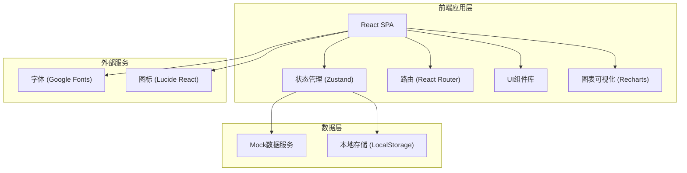
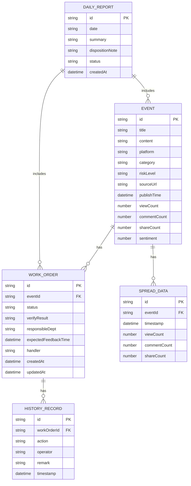

## 1. 架构设计



## 2. 技术选型说明

- **前端框架**: React@18 + TypeScript - 确保类型安全和组件化开发
- **构建工具**: Vite@5 - 快速的开发体验和构建性能
- **样式方案**: TailwindCSS@3 - 原子化CSS，快速构建深色工业风界面
- **状态管理**: Zustand - 轻量级状态管理，适合中小型应用
- **路由管理**: React Router@6 - 单页应用路由
- **图表库**: Recharts - React生态友好的数据可视化库
- **图标库**: Lucide React - 简洁线性图标，符合设计风格
- **字体**: Noto Sans SC + JetBrains Mono - 中文显示和等宽数字
- **数据**: Mock数据 + LocalStorage持久化工单状态

## 3. 目录结构

```
├── src/
│   ├── components/          # 公共组件
│   │   ├── layout/         # 布局组件
│   │   │   ├── Header.tsx
│   │   │   ├── Sidebar.tsx
│   │   │   └── PageContainer.tsx
│   │   ├── ui/             # 基础UI组件
│   │   │   ├── Card.tsx
│   │   │   ├── Button.tsx
│   │   │   ├── Badge.tsx
│   │   │   ├── Select.tsx
│   │   │   └── Input.tsx
│   │   └── charts/         # 图表组件
│   │       ├── TrendChart.tsx
│   │       ├── WordCloud.tsx
│   │       └── GaugeChart.tsx
│   ├── pages/              # 页面组件
│   │   ├── Dashboard/      # 首页态势
│   │   │   ├── RiskOverview.tsx
│   │   │   ├── HotWords.tsx
│   │   │   ├── RiskList.tsx
│   │   │   ├── AlertStream.tsx
│   │   │   └── index.tsx
│   │   ├── EventDetail/    # 事件详情
│   │   │   ├── OriginalPost.tsx
│   │   │   ├── SpreadAnalysis.tsx
│   │   │   ├── WorkOrderForm.tsx
│   │   │   ├── HistoryTimeline.tsx
│   │   │   └── index.tsx
│   │   └── DailyReport/    # 日报中心
│   │       ├── DataSummary.tsx
│   │       ├── HighFreqIssues.tsx
│   │       ├── ProcessedItems.tsx
│   │       ├── LeaderAttention.tsx
│   │       ├── ReportPreview.tsx
│   │       └── index.tsx
│   ├── store/              # 状态管理
│   │   ├── useDashboardStore.ts
│   │   ├── useWorkOrderStore.ts
│   │   └── useReportStore.ts
│   ├── data/               # Mock数据
│   │   ├── mockEvents.ts
│   │   ├── mockWorkOrders.ts
│   │   └── mockReports.ts
│   ├── types/              # TypeScript类型定义
│   │   ├── event.ts
│   │   ├── workOrder.ts
│   │   └── report.ts
│   ├── utils/              # 工具函数
│   │   ├── date.ts
│   │   └── riskLevel.ts
│   ├── App.tsx
│   ├── main.tsx
│   └── index.css
├── public/
├── index.html
├── vite.config.ts
├── tsconfig.json
├── tailwind.config.js
└── package.json
```

## 4. 路由定义

| 路由 | 页面 | 说明 |
|------|------|------|
| `/` | 首页态势 | 重定向到 `/dashboard` |
| `/dashboard` | 首页态势 | 风险概览、热词云、风险列表、实时告警 |
| `/event/:id` | 事件详情 | 舆情原文、传播分析、工单流转、处置记录 |
| `/report` | 日报中心 | 数据汇总、高频问题、日报生成与导出 |

## 5. 核心数据模型

### 5.1 数据模型ER图



### 5.2 TypeScript 类型定义

```typescript
// event.ts
export type RiskCategory = 'complaint' | 'crowd' | 'overcharge' | 'service' | 'safety';
export type RiskLevel = 'high' | 'medium' | 'low' | 'resolved';
export type Platform = 'weibo' | 'douyin' | 'xiaohongshu' | 'dianping';

export interface Event {
  id: string;
  title: string;
  content: string;
  platform: Platform;
  category: RiskCategory;
  riskLevel: RiskLevel;
  sourceUrl: string;
  publishTime: Date;
  viewCount: number;
  commentCount: number;
  shareCount: number;
  sentiment: number;
  author: string;
}

export interface SpreadDataPoint {
  timestamp: Date;
  viewCount: number;
  commentCount: number;
  shareCount: number;
}

// workOrder.ts
export type WorkOrderStatus = 'pending' | 'processing' | 'responded';

export interface WorkOrder {
  id: string;
  eventId: string;
  status: WorkOrderStatus;
  verifyResult: string;
  responsibleDept: string;
  expectedFeedbackTime: Date;
  handler: string;
  createdAt: Date;
  updatedAt: Date;
}

export interface HistoryRecord {
  id: string;
  workOrderId: string;
  action: string;
  operator: string;
  remark: string;
  timestamp: Date;
}

// report.ts
export interface DailyReport {
  id: string;
  date: Date;
  totalEvents: number;
  highRiskCount: number;
  processedCount: number;
  pendingCount: number;
  highFreqIssues: HighFreqIssue[];
  leaderAttention: LeaderAttentionItem[];
  dispositionNote: string;
  status: 'draft' | 'final';
  createdAt: Date;
}

export interface HighFreqIssue {
  category: RiskCategory;
  count: number;
  examples: string[];
}

export interface LeaderAttentionItem {
  type: 'highRisk' | 'crossDept' | 'decision';
  title: string;
  description: string;
  level: RiskLevel;
}
```

## 6. 状态管理设计

### Dashboard Store
```typescript
interface DashboardState {
  selectedScenic: string;
  selectedDate: Date;
  selectedPlatforms: Platform[];
  selectedCategory: RiskCategory | 'all';
  events: Event[];
  loading: boolean;
  setSelectedScenic: (scenic: string) => void;
  setSelectedDate: (date: Date) => void;
  togglePlatform: (platform: Platform) => void;
  setSelectedCategory: (category: RiskCategory | 'all') => void;
  fetchEvents: () => Promise<void>;
}
```

### WorkOrder Store
```typescript
interface WorkOrderState {
  workOrders: Record<string, WorkOrder>;
  historyRecords: Record<string, HistoryRecord[]>;
  createWorkOrder: (eventId: string, data: Partial<WorkOrder>) => void;
  updateWorkOrder: (workOrderId: string, data: Partial<WorkOrder>) => void;
  addHistoryRecord: (workOrderId: string, record: Omit<HistoryRecord, 'id'>) => void;
  getWorkOrderByEventId: (eventId: string) => WorkOrder | undefined;
}
```

## 7. 关键技术实现点

1. **深色主题配置**：在 `tailwind.config.js` 中扩展自定义颜色、字体和动画
2. **热词云图**：使用CSS transform实现动态布局，按词频和风险等级控制大小和颜色
3. **实时告警流**：使用CSS动画实现垂直滚动，新消息高亮闪烁
4. **传播趋势图**：使用Recharts面积图，支持关键节点标记
5. **工单状态流转**：状态机实现，确保状态变更的合法性
6. **本地持久化**：使用LocalStorage存储工单数据，刷新不丢失
7. **数字滚动动画**：自定义Hook实现数字从0到目标值的平滑过渡
8. **响应式布局**：使用Tailwind响应式断点，适配桌面和Pad

## 8. 性能优化

- 图表组件使用 `React.memo` 避免不必要重渲染
- 大数据量列表采用虚拟滚动（如事件列表超过50条）
- 热词云图使用 `requestAnimationFrame` 优化动画性能
- 路由懒加载，减少首屏加载时间
- LocalStorage操作使用防抖，避免频繁读写
